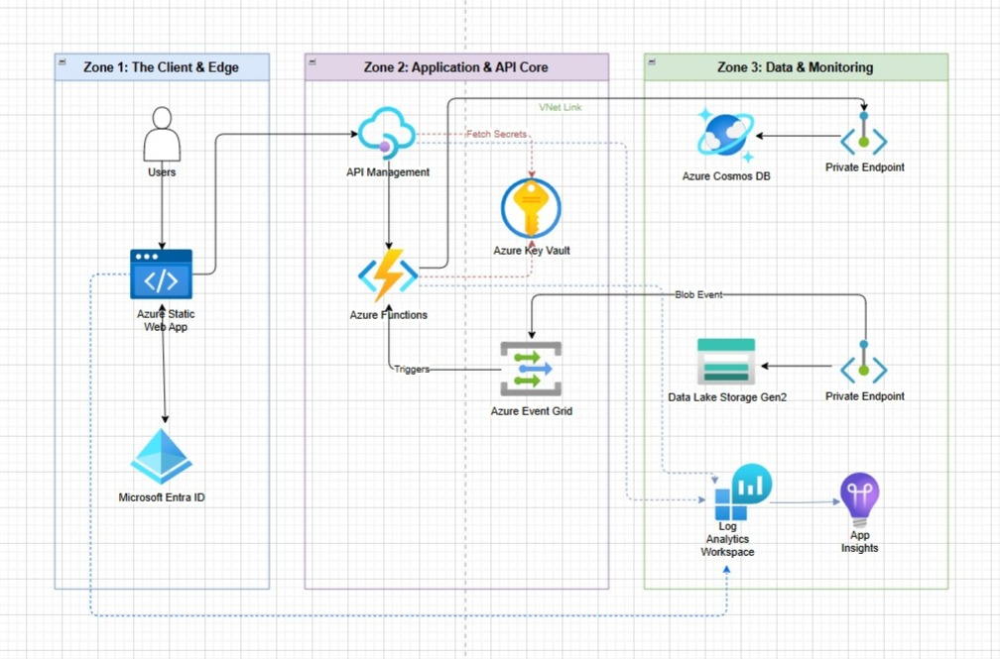

# Serverless Analytics Engine

  

This project is a fully automated, event-driven analytics pipeline. You drop a raw CSV file into a data lake, and within milliseconds, a serverless backend parses it, securely upserts the data into a NoSQL database, and makes it available to a lightning-fast React frontend. No servers to manage, no idle costs, and zero manual intervention.

## The Architecture

Engineered this pipeline to mirror a real-world, enterprise-grade cloud architecture.

### What's the Advantage 

* **The Ingestion Engine (Azure Data Lake + Event Grid):**
  Instead of building a traditional API endpoint to handle massive file uploads (which can timeout and crash), we rely on Azure Event Grid. The moment a file lands in the Data Lake, Event Grid fires a webhook to wake up our compute layer.
* **The Compute Layer (Azure Functions - Node.js):**
  Pure serverless. The code only runs when an event triggers it, meaning our compute costs scale exactly with our traffic (down to zero). 
* **The Database (Azure Cosmos DB):**
  We needed sub-millisecond read times to power the React dashboard's filtering system. Cosmos DB partitioned by `customer_region` allows the UI to slice massive datasets instantly.
* **The Edge (React + Azure Static Web Apps):**
  The frontend is heavily cached at the edge for global performance, and SWA natively proxies our Azure Function API to prevent CORS issues.

## Security & Observability (The "Enterprise" Polish)

I didn't just want this to work; I wanted it to be production-ready. 
* **Zero-Trust Secrets:** There are no hardcoded database keys in this repository. All credentials are locked in **Azure Key Vault**, and our Function App uses an Entra ID Managed Identity to access them.
* **Live Telemetry:** The entire backend is instrumented with **Application Insights**. We can track database query times, dependency mapping, and exact execution milliseconds natively.

